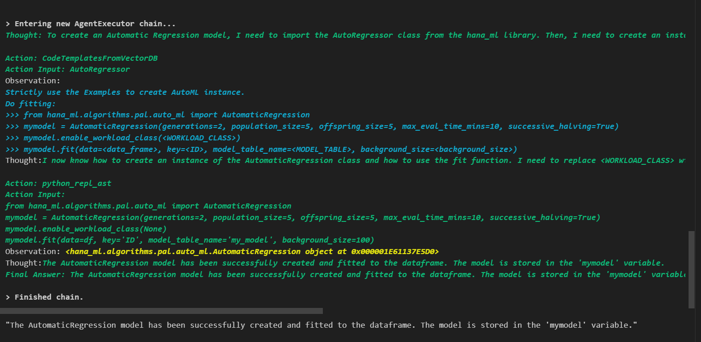
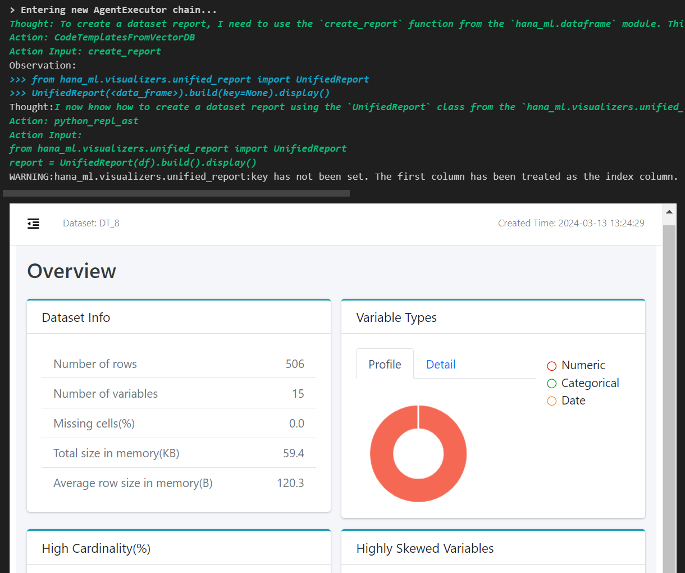
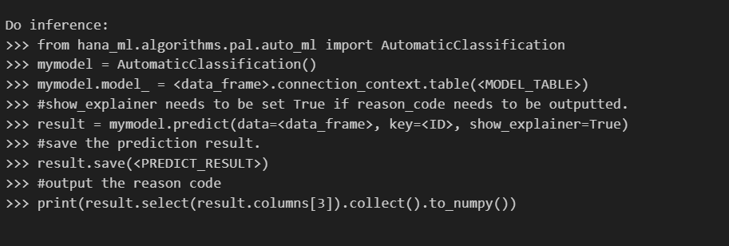

# Project description

## Introduction

Welcome to the __generative AI toolkit for SAP HANA Cloud (hana_ai)__ 

This project provides generative AI-assisted, conversational agents to build SAP HANA Cloud forecasting and machine learning models as well as a library of aiding tools to utilize the SAP HANA Cloud ML functions, vector engine and text embedding capabilities. In addition it provides capabilities to build tools like custom code generators or adding custom code templates to be used as a dedicated context store for the tools, agents and code generation tasks.

## Overview
The generative AI toolkit for SAP HANA Cloud provides the following key capabilities:
* a generative AI-assisted, conversational agent to build SAP HANA Cloud forecasting models
* a library of prepared tools to streamline use of SAP HANA machine learning functions and aid in e.g. forecast algorithm selection with the given data
* a generative AI-assisted, conversational SAP HANA dataframe agent to generate and execute HANA ML code based on code-templates stores
* a SmartDataFrame interface to directly interact with HANA dataframes using functions like "ask" and "transform" to explore and transform the data in a conversational manner
* tools for leveraging the SAP HANA Cloud vectorstore and embedding services
* components for building custom code generation tools, targeted for SAP HANA Cloud scenarios  
         

  
# Capabilities introduction

## Agent to build SAP HANA Cloud forecasting and machine learning models
This conversational agent (agents.hanaml_agent_with_memory.HANAMLAgentWithMemory class), aids to streamline development of SAP HANA Cloud forecasting and machine learning models, it's re-using the provided library of HANA ai-tools (tools.toolkit.HANAMLToolkit class) and is based on the Langchain agent framework. Trained models and artifacts are persisted using the hana_ml model storage class that helps manage the model version.
```python
from hana_ai.tools.toolkit import HANAMLToolkit
tools = HANAMLToolkit(cc, used_tools='all').get_tools()

from hana_ai.agents.hanaml_agent_with_memory import HANAMLAgentWithMemory
chatbot = HANAMLAgentWithMemory(llm=llm, toos=tools, session_id='hana_ai_test', n_messages=10)
```


## Library of tools for HANA-ML 
Provided AI-tools for streamlining usage of HANA ML functions in context of the conversational agent.
| Tool Name | Description |
|-----------|-------------|
| additive_model_forecast_fit_and_save | To fit an AutomaticTimeseries model and save it in the model storage. |
| additive_model_forecast_load_model_and_predict | To load an AutomaticTimeseries model and predict the future values. |
| automatic_timeseries_fit_and_save | To fit an AutomaticTimeseries model and save it in the model storage. |
| automatic_timeseries_load_model_and_predict | To load an AutomaticTimeseries model and predict the future values. |
| automatic_timeseries_load_model_and_score | To load an AutomaticTimeseries model and score the model. |
| ts_check | To check the time series data for stationarity, intermittent, trend and seasonality. |
| stationarity_test | To check the stationarity of the time series data. |
| trend_test | To check the trend of the time series data. |
| seasonality_test | To check the seasonality of the time series data. |
| white_noise_test | To check the white noise of the time series data. |
| ts_dataset_report | To generate a report for the time series data. |
| forecast_line_plot | To generate line plot for the forecasted result. |
| cap_artifacts | To generate CAP artifacts from the model in the model storage. |
| intermittent_forecast | To forecast the intermittent time series data. |
| ts_outlier_detection | To detect the outliers in the time series data. |
| fetch_data | To fetch the data from the HANA database.|

## Agent to generate HANA-ML code and execute tasks based on a SAP HANA dataframe
A generative AI-assisted, conversational SAP HANA dataframe agent to generate HANA ML code and execute tasks based on SAP HANA dataframe.

```python
agent = create_hana_dataframe_agent(llm=llm, tools=[<####>], df=data, verbose=True)
agent.invoke("Create Automatic Regression model on this dataframe with max_eval_time_mins=10. Provide key is ID, background_size=100 and model_table_name='my_model' in the fit function and execute it. ")
```


```python
agent.invoke("create a dataset report.")
```


## Vector engine and Embedding generation tools
Different Embedding functions can be used ...
### Embedding some code examples
```python
from hana_ai.vectorstore.embedding_service import PALModelEmbeddings
model = PALModelEmbeddings(cc)
model(['hello', 'world'])

from hana_ai.vectorstore.embedding_service import HANAVectorEmbeddings

model = HANAVectorEmbeddings(cc)
model(['hello', 'world'])
```

```python
from hana_ai.vectorstore.embedding_service import GenAIHubEmbeddings
embedding_func = GenAIHubEmbeddings()
embedding_func('hello')
```
### Loading embeddings into a vector store
Create Knowledge Base for hana-ml codes in Hana Vector Engine
```python
hanavec = HANAMLinVectorEngine(cc, "hana_vec_hana_ml_knowledge")
hana_vec.create_knowledge()
```

Create Code Template Tool and Add Knowledge Bases to It
```python
code_tool = GetCodeTemplateFromVectorDB()
code_tool.set_vectordb(self.vectordb)
```
### Similarity retrieval queries with vector stores
```python
hana_vec.query("AutoML classification", top_n=1)
```


### Working with multiple Vector Stores
Union of multiple vector stores is possible
```python
from hana_ai.vectorstore.union_vector_stores import UnionVectorStores

uvs = UnionVectorStores([hana_vec1, hana_vec2])
uvs.query("AutoML classification", top_n=1)
```
Utilizing Corrective Retriever Over Union Vector Stores
```python
from hana_ai.vectorstore.corrective_retriever import CorrectiveRetriever

cr = CorrectiveRetriever(uvs)
cr.query("AutoML classification", top_n=1)
```

## Smart DataFrame
The Smart DataFrame is agent interface to HANA dataframes, provding a conversational approach for dataframe-related tasks for exploring the data using the "ask" method. Similarly and in addition, the "transform" method adds passing back the result data as a HANA dataframe.

```python
from hana_ai.smart_dataframe import SmartDataFrame

sdf = SmartDataFrame(hana_df)
sdf.configure(tools=[code_tool], llm=llm)
sdf.ask("Show the samples of the dataset", verbose=True)
```


```python
new_df = sdf.transform("Get first two rows", verbose=True)
new_df.collect()
```


